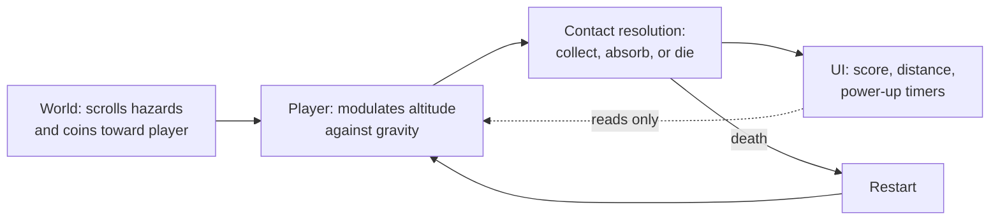
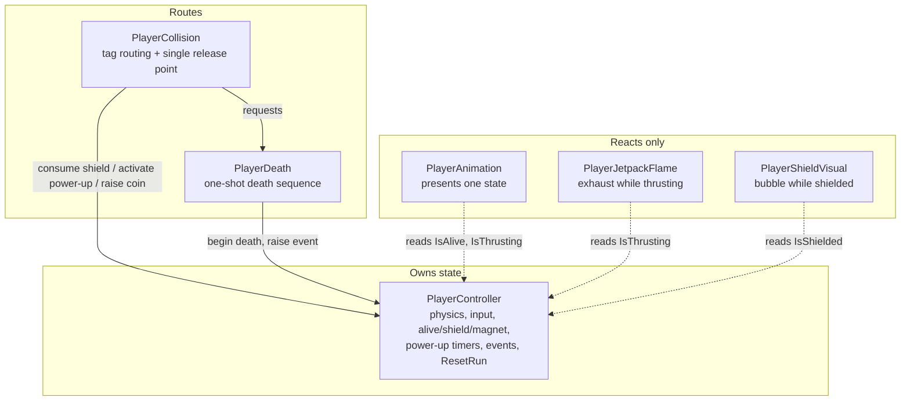
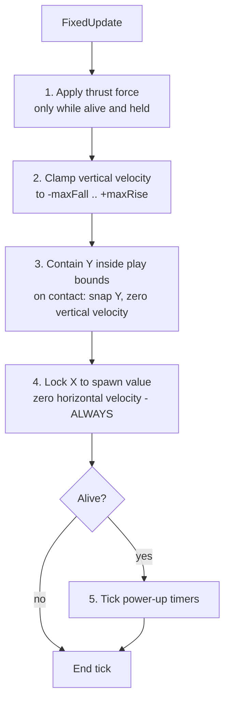
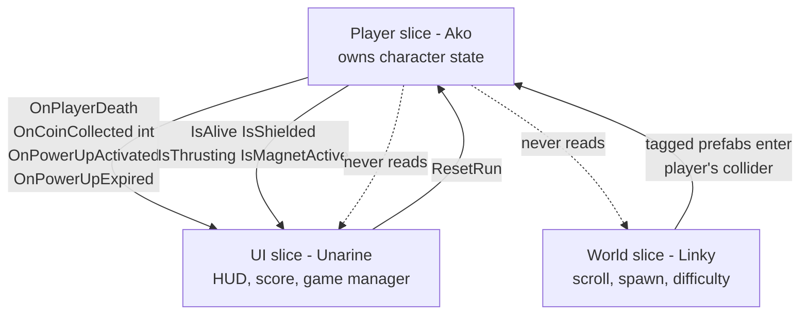
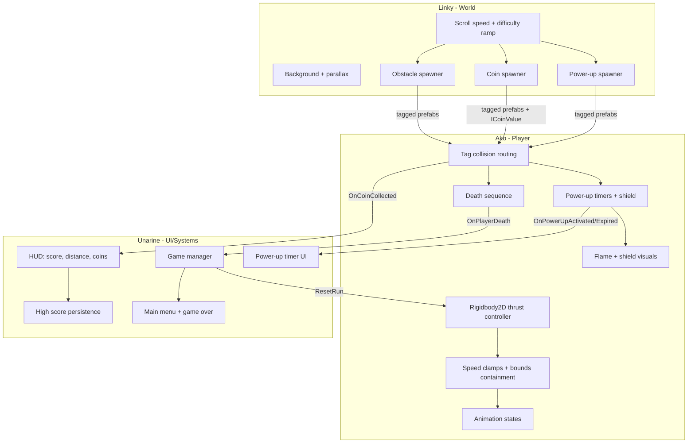

# Individual Game Design Document
## Player / Core Gameplay System — Jetpack Joyride Clone

**Author:** Ako Baloyi
**Role:** Person 1 — Player character, mechanics, animation, collision, death, collectible interaction, power-up effects
**Team:** Ako Baloyi (player), Linky Nzuza (world/obstacles), Unarine (UI/scoring/systems)
**Engine:** Unity 6000.0.53f1, 2D URP

---

## 0. Rubric map

| Rubric criterion | Section |
|---|---|
| Game research: category & sub-category, genre analysis | 1 |
| Interrogation: what we are questioning, hypothesis | 2 |
| Group design goals | 2.3 |
| **Personal design goals and intended contribution** | 2.4 |
| Actions and challenges that make up gameplay | 3 |
| **Feature documentation — micro-level** | 4 |
| **Feature documentation — macro-level / cohesive design** | 5 |
| **Diagrams and technical breakdowns** | 4.1, 4.2, 5.1 |
| **Iterative design process and why things changed** | 6 |
| Testing, evaluation, decision-making | 7 |
| Production process and role fulfilment | 8 |
| **Personal reflection** | 9 |
| Project plan: systems and dependencies | 10 |

Sections in bold are the individual submission's weighted criteria.

**Critical framing.** The course requires design and process to be articulated into the
field rather than described in isolation. Three set works are used as working tools
rather than citations of convenience, and each is applied where it does real work:

| Work | Where it is used | What it does |
|---|---|---|
| Anthropy & Clark, *A Game Design Vocabulary* | 1.4, 2.2, 3.1 | Gives the vocabulary for the verb-economy claim at the centre of the hypothesis |
| Bogost, *Unit Operations* | 1.4, 5.1 | Frames both the endless runner's content model and the team's system architecture |
| Maxwell-Gardner, *The Game Production Handbook* | 1.4, 8 | Frames the production process, build cadence, and role division honestly |

---

## 1. Game research

### 1.1 The game being cloned

*Jetpack Joyride* (Halfbrick Studios, 2011) is a side-scrolling endless runner. The
player controls Barry Steakfries, who breaks into a laboratory and steals a
machine-gun-powered jetpack. The character moves forward automatically; the player
controls only altitude, dodging hazards and collecting coins until they die. There is no
win condition — only distance.

### 1.2 Category and sub-category

**Category:** Action.
**Sub-category:** Endless runner, specifically the *one-touch* or *single-input* branch.

The endless runner genre splits meaningfully by input verb:

| Sub-type | Input | Examples |
|---|---|---|
| Jump-runner | Discrete jump, sometimes double-jump | *Canabalt*, *Temple Run* |
| Lane-switcher | Discrete lateral commit | *Subway Surfers* |
| **Hover / thrust-runner** | **Continuous analogue-by-duration hold** | ***Jetpack Joyride***, *Flappy Bird* (impulse variant) |

*Jetpack Joyride* sits in the third group, and that is the distinction our clone is built
around. This matters because it changes what skill means. In a jump-runner, skill is
timing a discrete commitment. In a thrust-runner, skill is *continuous modulation* —
the player is always adjusting, never merely reacting.

### 1.3 What defines the genre

Four properties define the endless runner, and each one shifts the design burden:

1. **Automatic forward motion.** The player never chooses to advance. This removes
   navigation as a skill and concentrates all skill into one axis.
2. **Procedural, unbounded content.** No authored level to memorise, so difficulty must
   come from systems rather than layout.
3. **Single failure state.** One hit ends the run. This makes every hazard maximally
   meaningful and makes the death sequence emotionally load-bearing.
4. **Score as the only goal.** Progress is a number, so the game must be readable at a
   glance and instantly restartable.

Property 1 is why my slice locks the player's horizontal position rather than moving
them: the *world* moves, and the player's entire expressive range is vertical. Property 3
is why the death sequence in my slice must fire exactly once and be unambiguous.

### 1.4 Critical framing

#### Verbs, not controls — Anthropy & Clark

Anthropy and Clark argue that a game's expressive vocabulary is its **verbs**: what the
player can do, and what those doings mean in context. Crucially, a verb is not the button
that triggers it. A verb is constituted by what it acts upon and what resists it.

This distinction is what makes our interrogation precise. Described as a control,
*Jetpack Joyride* has one button, and there is nothing to analyse. Described as a verb,
the player's action is not "press" but **"apply upward force against gravity"** — and
that verb has an object (the character's momentum) and a resistance (gravity). The
resistance is *part of the verb*, not a separate system it happens to interact with.

This reframing is load-bearing for the whole document. It relocates the question from
input handling, where there is nothing to find, to the physical relationship the input
addresses, where everything is. Section 2 formalises that as the hypothesis.

Anthropy and Clark also observe that games say something through their verb economy.
*Jetpack Joyride*'s vocabulary is worth reading on those terms: the character is
**always falling**, and thrust is only ever a temporary interruption of the default
state. Effort is momentary; gravity is permanent. For a game about a man who steals a
jetpack and never arrives anywhere, that is a coherent statement, and it is expressed
entirely through mechanics rather than narration.

#### Units, not systems — Bogost

Bogost distinguishes **unit operations** — discrete, encapsulated, recombinant elements
whose meaning emerges from configuration — from **system operations**, which are
totalising and hierarchical. He draws the analogy to object-oriented software explicitly,
which makes the framework unusually applicable here, at two levels.

**At the level of content.** An endless runner has no authored totality. There is no
level to read, only a stream of recombinant units — hazard, coin, power-up — whose
*configurations* generate challenge. Difficulty is not designed; it is a property of how
units are permitted to combine. This is why genre property 2 shifts the design burden
onto systems: the designer authors the combination rules, not the experience.

**At the level of architecture.** Our three slices are unit operations in Bogost's sense.
The player publishes state and events outward and reads nothing back. There is no central
orchestrator computing the game's behaviour top-down. Gameplay is what emerges when the
three units are configured together.

The alternative was available and is the more common student solution: a `GameManager`
that owns the player, polls its state, and drives the other systems. That is a system
operation — totalising, hierarchical, and, in a three-person team, a single file three
people must edit simultaneously. Section 5.1 returns to this, because choosing units over
systems had consequences for both the code and the collaboration.

#### Production as design constraint — Maxwell-Gardner

Maxwell-Gardner treats production not as administration downstream of design but as a
constraint that shapes what can be designed. Schedule, role division, integration
cadence, and risk are design inputs.

This matters because the brief's demand for a build every two days is not a bureaucratic
requirement — it is a design instrument. Continuous integration means the team feels the
whole game repeatedly rather than discovering it once at the end. Section 8 assesses how
well we actually met that, and section 6 records two occasions where a production
constraint directly overrode a technical preference.

---

## 2. Interrogation

### 2.1 What we are questioning

*Jetpack Joyride* gives the player **one binary input**. There is no aim, no attack, no
dodge, no lane, no double-jump. Held or not held. That is the entire control surface.

And yet the game does not feel impoverished. It feels precise. Players develop real
skill, describe near-misses in detail, and can distinguish a good run from a lucky one.
Two players with the same single button perform visibly differently.

**That is the contradiction we chose to interrogate: how does a single binary input
produce a wide expressive range?**

This is a genuinely non-obvious question. A binary input has two states, so the
expressiveness cannot be in the input. It has to be manufactured somewhere else — and
finding *where* is the reverse-engineering task.

### 2.2 Hypothesis

> **The expressive range of *Jetpack Joyride* does not come from the input. It comes
> from the physical simulation the input pushes against.**
>
> Because thrust is applied as a *continuous force competing with gravity* rather than
> as a position change or a velocity impulse, the player is not choosing between two
> states — they are choosing a **duration**, and duration maps continuously onto
> altitude, velocity, and momentum. The button is binary; the state space it addresses
> is not.
>
> We therefore predict that the felt quality of the game is governed almost entirely by
> the **relationship between four numbers** — thrust force, gravity, maximum rise speed,
> and maximum fall speed — and that changing their *ratios* while leaving the input
> untouched will produce recognisably different games.

This hypothesis is falsifiable, which is what makes it useful. If the feel were really
in the input handling, then tuning those four numbers would change difficulty but not
character. If the hypothesis holds, tuning them should change the game's *personality*:
floaty versus heavy, forgiving versus twitchy.

**In Anthropy and Clark's terms**, the hypothesis is a claim about where a verb's meaning
resides. If a verb is constituted by its object and its resistance, then modifying the
resistance modifies the verb — even when the input that triggers it is untouched. The
prediction is therefore quite specific: *we should be able to change the game's verb
without changing a single line of input code.* Every tuning pass is a test of that claim,
and the code that reads the button is the control variable.

### 2.3 Group design goals

1. Reproduce the core loop — thrust, dodge, collect, die, restart — as a playable
   artefact, not a demo.
2. Build the three systems (player, world, UI) concurrently in one shared project, with
   integration proven continuously rather than merged at the end.
3. Keep the systems decoupled enough that three people can work without blocking each
   other.
4. Make the game readable at a glance, in line with genre property 4.

### 2.4 My personal design goals

My slice is the character controller, which means **my slice is where the hypothesis
lives or dies**. If the expressive range comes from the force-versus-gravity
relationship, then it is my four numbers that carry it. My goals followed from that:

1. **Make thrust a force, not a movement.** Resist the easier implementations —
   setting position directly, or applying a fixed upward velocity — because both would
   collapse the continuous state space the hypothesis depends on. This was a design
   commitment, not a technical one.

2. **Make the four numbers live-tunable during play.** If the hypothesis is that ratios
   govern feel, the prototype must let us *test* that by changing them and feeling the
   difference immediately. Requiring a recompile between tunings would make the central
   claim untestable.

3. **Build an isolated environment for evaluating feel.** The world slice would not be
   ready when the controller was, and feel cannot be judged in a vacuum. I needed
   something to dodge in order to know whether the numbers were right.

4. **Treat the vertical bounds as design space, not as a wall.** Decide deliberately
   whether leaving the screen kills or contains, and justify it against the hypothesis.

5. **Publish state outward and consume nothing.** So that my teammates' systems could
   be built against my slice while it was still changing.

My intended contribution beyond my assigned role: owning the integration contract that
the other two slices consume, and owning the tuning methodology the group uses to judge
whether the clone feels like the original.

---

## 3. Actions and challenges

### 3.1 The player's verbs

The complete verb set, which is deliberately tiny:

| Verb | Input | Consequence |
|---|---|---|
| **Thrust** | Hold | Upward force accumulates against gravity |
| **Fall** | Release | Gravity accumulates unopposed |
| *(Collect)* | — | Passive, resolved by contact |
| *(Absorb)* | — | Passive, consumes a held shield |

Only two verbs are active. Collection and absorption are *consequences* of positioning
rather than actions, which is important: the player never presses a "collect" button, so
every pickup is really a navigation decision made earlier.

Following Anthropy and Clark, the table above is deliberately written as verbs rather than
controls, and the two active verbs are really one verb with two polarities — the player is
always modulating a single quantity. This is the narrowest possible vocabulary that still
produces a game, which is precisely why it is worth interrogating. A game with two verbs
that feels expressive has to be manufacturing that expressiveness structurally.

Note also what the vocabulary *excludes*. There is no verb for attacking, evading,
stopping, or waiting. The player cannot decline to play — releasing the button is still an
action with consequences, because the default state is falling. There is no neutral input.
That absence is a design choice with real weight: it means the player is never idle, and
attention can never lapse.

### 3.2 The challenge taxonomy

What the player is actually being asked to solve:

| Challenge | Skill tested | System |
|---|---|---|
| Thread a gap between hazards | Sustained altitude precision | Player + world |
| Reach a coin line without hitting a hazard | Risk/reward routing | Player + world |
| Recover from a bad altitude | Momentum management | Player |
| Decide whether to spend a shield | Resource judgement | Player |
| Survive increasing density | Endurance, adaptation | World |

**The tension that makes it a game:** coins and hazards occupy the same space. The
optimal *survival* path is rarely the optimal *scoring* path. Every altitude choice is
therefore a wager, and because altitude changes take time to execute (force, not
teleport), the wager must be committed to early. That delay between decision and effect
is where the skill lives — and it is a direct consequence of the hypothesis.

### 3.3 How the systems combine to produce the experience

The experience emerges from the *rate* at which the world delivers challenge versus the
*latency* of the player's ability to respond. Neither system alone produces the feel.
The world sets the problem density; my slice sets the response latency. Tuning the game
means tuning the relationship between those two.

---

## 4. My system — micro level

### 4.1 Component structure

Six components on one GameObject. Four own behaviour, two are pure presentation.

The single most important structural rule: **`PlayerController` is the only component
that owns state.** Everything else reads it or asks it to change. This is what makes the
"exactly once" guarantees enforceable in one place instead of five.

Presentation components read published state and never input. This matters for design
reasons, not just architectural ones: it guarantees the flame can never show while the
character is dead, and the animation can never disagree with the physics, because both
derive from the same source.

### 4.2 The fixed tick order

Several rules can apply on the same physics tick, so their order is fixed and deliberate.

**Why clamp before contain:** a tick needing both should end at the containment result
of zero velocity, not the clamped value. If containment ran first, the clamp would
re-introduce velocity into a body that is supposed to be resting against a bound, and
the character would jitter at the ceiling.

**Why step 4 is unconditional:** it runs even while dead and even while physics
simulation is disabled. Horizontal drift would break the core premise of the genre
(automatic forward motion, player fixed), so it is enforced with no exceptions.

### 4.3 The four numbers, and what each does to the experience

This table is the practical form of the hypothesis. Each parameter is Inspector-exposed
and re-read every tick, so it can be changed mid-play.

| Parameter | Default | Range | What it does to *feel* |
|---|---|---|---|
| Thrust force | 35 | 0.1–500 | Authority. Low = sluggish, unresponsive. High = twitchy, hard to hold a line |
| Gravity scale | 3 | 0.1–20 | Punishment for releasing. Low = floaty and forgiving. High = heavy, demanding |
| Max rise speed | 8 | 0.1–100 | Ceiling on ascent. Caps how fast a mistake can be corrected upward |
| Max fall speed | 12 | 0.1–100 | Ceiling on descent. Sets the worst-case reaction window |

**Design decision — asymmetric clamps.** Max fall (12) is deliberately faster than max
rise (8). Falling should feel heavier than rising, so that releasing the button has
consequence and the jetpack reads as *working against* something rather than simply
toggling direction. A symmetric pair felt weightless in testing — the character behaved
like a cursor rather than a body.

**Design decision — the ratio matters more than the values.** Thrust 35 against gravity
3 is a ratio, and scaling both leaves the feel broadly intact while changing the
timescale. This is the clearest support for the hypothesis we found: the game's
personality tracks the ratio, not the magnitudes.

### 4.4 Design decision — containment rather than death at the bounds

Leaving the visible play area could either kill the player or stop them. We chose to
contain, and this is a design choice with real consequences.

Containing turns the ceiling and floor into **tactical space**. A player can ride the
ceiling to cross a low hazard field, or hug the floor under a high one. The bound
becomes a resource.

Killing on bounds exit would instead make the top of the screen a second hazard, and
would punish the player for an input they are actively holding — which reads as unfair
in a game whose only verb is holding. It would also contradict the hypothesis: if the
top of the screen kills, the usable state space shrinks and expressiveness drops.

Hitting a bound is therefore explicitly non-fatal. Position snaps to the limit and
vertical velocity zeroes, but alive and shield state are untouched.

### 4.5 Rules that required explicit decisions

Cases where the "obvious" behaviour was ambiguous, and why we chose as we did.

| Rule | Decision | Design reason |
|---|---|---|
| A coin touched by several colliders in one frame | Counts exactly once | Score must be trustworthy or the only goal in the game becomes meaningless |
| Two hazards hit while shielded in the same frame | One shield consumed, then death | Fair reading. A shield is one hit, not one frame of invulnerability |
| Re-collecting a power-up already active | Refresh timer, no second activation event | Stacking would let players bank power-ups, flattening the risk/reward of collecting one |
| Death triggered by multiple contacts | Fires exactly once | Genre property 3: a single failure state must be unambiguous |
| Button held through a restart | Counts as released until pressed again | Otherwise the player launches instantly at the start of a new run with no input |
| Press and release inside one physics tick | Still produces one tick of thrust | A fast tap that produced nothing would read as dropped input |

---

## 5. My system — macro level

### 5.1 The integration contract

My slice publishes state and events outward and reads nothing from the other two. This
one-directional flow is what let three people build concurrently in one project.

**Read-only state:** `IsAlive`, `IsShielded`, `IsThrusting`, `IsMagnetActive`

**Events out:**

| Event | Meaning |
|---|---|
| `OnPlayerDeath` | Exactly once per run |
| `OnCoinCollected(int)` | Carries that coin's value |
| `OnPowerUpActivated(PowerUpType)` | A power-up became active |
| `OnPowerUpExpired(PowerUpType)` | Timer elapsed, shield consumed, or run ended |

**Operation:** `ResetRun()` restores the initial state without reloading the scene.

**The invariant that makes the UI slice possible:** every activation is matched by
exactly one expiry — whether the power-up ended by timer, by shield consumption, or by
death. Without this guarantee, Unarine's power-up timer UI would drift out of sync and
she would have to defensively re-read state. With it, she can trust the events alone.

Subscribers are each invoked inside their own try/catch, so a fault in another slice
cannot break the player. This was a decision about *team* robustness as much as code:
it means a bug in the UI slice cannot make my slice look broken during a shared build.

### 5.1a Units over systems — and what it cost

This structure is a deliberate choice of unit operations over a system operation, in
Bogost's sense. The player is encapsulated: it exposes an interface and computes its own
behaviour. No component above it computes on its behalf.

The conventional alternative was a `GameManager` holding references to all three systems,
polling the player each frame and pushing results to the UI. That is a system operation —
totalising, hierarchical, one authority. It is also easier to write, and it is what the
original plan for this project implied by naming a GameManager as the third slice's
central component.

**What choosing units bought us.** Three people could work simultaneously without a
shared authority file. My slice was testable before either other slice existed, because
its correctness is defined by its own interface rather than by its position in a
hierarchy. Unarine could build against a specification rather than against my
implementation.

**What it cost.** Meaning that lives in configuration rather than in a central authority
is harder to *locate* when it goes wrong. There is no single place to read the game's
behaviour — you have to reason about the interaction of three units. Two of our
unresolved items are symptoms of exactly this: the magnet effect has no natural owner
because it spans two units, and the scene naming question has no authority to settle it.
A system operation would have made both trivially decidable, at the cost of the
parallelism that let us build at all.

That trade is the honest version. Unit operations are not simply better; they relocate
difficulty from implementation to coordination.

### 5.2 What my teammates needed from me

**Linky (world):** prefabs carry the exact case-sensitive tags `Obstacle`, `Coin`,
`PowerUp_Shield`, `PowerUp_Magnet` with trigger colliders. A coin should carry a
component implementing `ICoinValue` returning 1–1000; without one it falls back to 1, so
her prefabs work before she implements it.

**Unarine (UI):** subscribe to the four events, read the four properties, call
`ResetRun()`. I provided a working reference implementation
(`Assets/Scripts/_Sandbox/SandboxDebugHud.cs`) that consumes exactly this surface and
nothing else, so she had a concrete example rather than a description.

### 5.3 Where the interfaces are fragile

Honest assessment of the seams:

- **Tag strings are stringly-typed.** A typo in Linky's prefab fails silently at
  authoring time and loudly at runtime. Mitigated with a startup check that reports any
  unregistered tag, but not eliminated.
- **Shared files are the real integration risk.** `TagManager.asset`,
  `EditorSettings.asset`, and the shared scene are edited by all three slices and are the
  most likely merge conflicts.
- **The magnet is a contract with no owner.** I publish `IsMagnetActive`, but pulling
  coins requires touching the coin objects, which are Linky's. Unresolved.

---

## 6. Iterative design process

What changed from the original plan, and why. This is the honest version.

### 6.1 Architecture: abstracted core → direct components

**Original plan.** A "pure core, thin shell" split: all rules in plain C# classes with
no Unity dependency, wrapped by thin `MonoBehaviour`s, with adapter interfaces for
physics, logging, and audio cues. The goal was to make the rules testable without
launching Unity, and to make the engine's velocity API a single swappable call site.

**What changed.** Abandoned in favour of four self-contained `MonoBehaviour`s with logic
inline.

**Why.** The abstraction was solving a problem we did not have. It assumed the rules
would be verified by a large automated property-test suite; in a three-week team project
with a shared scene, the real verification was going to be *playing the game*. The
adapter layer added indirection that made the code harder for teammates to read, and
harder for me to tune quickly, which directly conflicted with personal design goal 2
(fast iteration on feel). The interfaces also could not be wired in the Inspector, which
pushed setup into code and away from the designer-facing workflow.

**What I lost.** Genuine ability to unit-test the rules in isolation. Verification is now
manual. In a longer project I would not make this trade.

### 6.2 Feel: a testable claim needed live tuning

**Original plan.** Serialized fields read once at startup.

**What changed.** All four numbers are re-read every tick, including gravity, so changes
in the Inspector take effect on the next physics tick during play.

**Why.** Directly forced by the hypothesis. If the claim is that ratios govern feel, then
the prototype must allow the ratio to be changed *while feeling it*. Restarting play mode
between tunings breaks the sensory comparison — by the time the game restarts you have
lost the memory of how the previous setting felt. This change turned the hypothesis from
an assertion into something we could actually probe.

### 6.3 Evaluation: added a sandbox that was not in the plan

**Original plan.** Test the player in the shared scene once the world slice existed.

**What changed.** Built a separate sandbox scene with a stand-in scroller, procedurally
generated colour-coded obstacles, coins and power-ups, a live state overlay, and hotkeys
to grant power-ups, force death, and reset.

**Why.** Two reasons. First, feel cannot be judged with nothing to dodge — I could not
evaluate whether 35-against-3 was right without hazards approaching at a rate. Second,
waiting on the world slice would have serialised the team, which contradicted group goal
2. The sandbox let me evaluate my own system on my own schedule.

**Unintended benefit.** Because the overlay consumes only the public surface, it became a
live proof that the integration contract works, and then became the reference
implementation I handed to Unarine. A testing tool turned into a communication tool.

### 6.4 Assets: six clone repos → CC0

**Original plan.** Borrow sprites and animations from existing Jetpack Joyride clone
repositories on GitHub, with attribution, to save time.

**What changed.** All six were rejected. Art is now entirely Kenney CC0.

**Why.** I checked the licences rather than assuming. Four of the six had no licence at
all, which under GitHub's terms means default copyright — all rights reserved. Citation
documents copying but does not grant permission. The two that did carry MIT and Apache
licences appeared to contain Halfbrick's original artwork, which the uploaders never held
rights to and therefore could not sub-licence onward. Attribution cannot fix that.

**The design upside I did not anticipate.** CC0 packs are internally consistent in style.
Mixed rips from six different projects would have looked incoherent, and visual coherence
is a design quality, not just a legal one. Constraint improved the outcome.

### 6.5 Input: Inspector-wired → code fallback

**Original plan.** The thrust action assigned as an `InputActionReference` in the
Inspector.

**What changed.** Kept the field, but the controller now builds an equivalent action in
code when nothing is assigned.

**Why.** An unassigned reference produces a prefab that silently cannot be played, with
no error explaining why. For a team project where teammates open each other's prefabs,
that is a trap. The fallback means the prefab works on first Play for anyone.

### 6.6 Presentation: authored asset references → runtime loading

**Original plan.** Wire flame and shield sprites as serialized references.

**What changed.** Both effects load their frames by name from `Resources` at runtime.

**Why.** A genuine failure. I authored Unity's sprite metadata by hand and duplicated an
internal sprite identifier across eleven sprites, which broke sub-asset resolution and
left the flame invisible. When I compared against metadata Unity generated itself, my
assumption about how sprite sub-assets are addressed was simply wrong. Rather than keep
guessing at engine internals, I removed the fragile references entirely. Loading by name
cannot break the same way.

**The lesson.** I chose a fragile approach because it was the one I could do without
opening the editor. The constraint I was optimising for was my own convenience, not the
project's robustness.

---

## 7. Testing, evaluation, and decision-making

The course requires all technical construction to be performed and tested. This section
states what was actually verified, by what method, and what was not — because an honest
account of coverage is more useful than a claim of correctness.

### 7.0 What was verified, and how

| Layer | Method | Status |
|---|---|---|
| Compilation | Compiled against Unity 6 engine assemblies after every change set | Passing, warnings understood and expected |
| Asset reference integrity | Scripted audit that every GUID referenced by prefab, scene, controller and clips resolves to a real asset | Passing; caught two real breakages |
| Sprite identifier uniqueness | Scripted audit for duplicate sprite IDs across all 156 imported sprites | Caught the flame bug described in 6.6 |
| Mechanical correctness | Live observation in the sandbox via the debug overlay | Ongoing |
| Feel | Play, adjust, replay in the sandbox | **Incomplete — see 12** |
| Rule correctness in isolation | *Not covered.* Automated tests were removed with the abstracted architecture (6.1) | **Gap** |

The asset-reference audit deserves note because it caught failures that would otherwise
have presented as "nothing happens," which is the hardest class of bug to notice. Both
real defects found during development — the invisible jetpack flame and a broken sprite
reference — were found by scripted verification rather than by looking at the game.

The last row is a genuine gap and a direct consequence of the architecture decision in
6.1. I traded the ability to verify rules in isolation for iteration speed on feel. That
was a defensible trade for a three-week prototype whose central claim is about feel, but
it means the "exactly once" guarantees in 4.5 are asserted and observed rather than
proven.

### 7.1 Method for evaluating feel

**Method.** Feel was evaluated in the sandbox scene by playing with hazards at varying
densities and adjusting the four numbers live. The debug overlay made state and event
counts visible so that mechanical correctness could be checked while playing rather than
inferred afterwards.

**Correctness checks made observable in the overlay:**

- Power-up activations versus expiries — if these ever diverge beyond the number
  currently active, the invariant is broken.
- Death count per run — must be exactly one however many hazards are clipped at once.
- Thrust after reset while the button is held — must stay released until re-pressed.

**Controls:** `Space` thrust, `R` reset, `K` force death, `1`/`2` grant shield/magnet.

The sandbox is isolated under `Assets/Scripts/_Sandbox/` and `Assets/Scenes/PlayerSandbox.unity`
and is intended to be deleted before final submission. Note that `Assets/Resources/PlayerFX/`
must survive that deletion — the player's flame and shield load from it.

---

## 8. Production process and role fulfilment

Framed through Maxwell-Gardner, who treats production as a design constraint rather than
administration downstream of design.

### 8.1 Role division and the dependency-first approach

The three slices were divided by system rather than by asset type — player, world, UI —
which Maxwell-Gardner would recognise as feature ownership rather than discipline
ownership. Each person owns a vertical slice including its logic and presentation.

The production risk in that model is that features have interfaces, and interfaces are
where parallel work stalls. My response was to specify and stub both of my interfaces
before either counterpart existed:

- The **inbound** interface (tags, trigger colliders, `ICoinValue`) was stubbed by the
  sandbox spawner, so I could test contact handling without Linky's prefabs.
- The **outbound** interface (four events, four properties, `ResetRun`) was stubbed by the
  sandbox HUD, which then became the reference implementation handed to Unarine.

This is the production decision I would defend most strongly. Neither teammate had to wait
for my slice to be finished to begin building against it, and I did not have to wait for
theirs.

### 8.2 Production constraints that overrode technical preference

Two occasions where the schedule shaped the design, which is Maxwell-Gardner's core claim
in practice:

1. **The abstracted architecture (6.1).** Technically the better structure. Removed
   because it slowed the iteration loop that the hypothesis depends on. The constraint was
   time-to-feedback, and it won.
2. **The input fallback (6.5).** A prefab that silently cannot be played is a
   collaboration hazard in a shared project, not just a bug. Designed for the failure mode
   of a teammate opening my prefab, not for the happy path.

### 8.3 Integration cadence — honest assessment

The brief requires a build every two days and explicitly warns against merging the whole
project at the end. This is the criterion I can assess least favourably.

**What the repository shows.** Work accumulated substantially before the first integration
commit, and the remote configuration changed partway through the project — the team moved
from an individually-owned repository to a shared one, with branches reorganised around
personal names rather than features. That reorganisation is itself evidence that the
integration strategy was settled during development rather than before it.

**Identified risks that remain.** Three files are edited by all three slices and are the
predicted conflict points: `ProjectSettings/TagManager.asset`,
`ProjectSettings/EditorSettings.asset`, and the shared scene. I flagged these and kept
project-settings changes in separate commits so they could be reviewed independently, but
flagging a risk is not the same as mitigating it.

▸ *Ako: this section needs your account of what actually happened. Did the team produce
builds on a two-day cadence? If not, what prevented it, and what would you do differently?
This is a criterion the brief states explicitly, so an honest negative answer with analysis
scores better than silence.*

---

## 9. Personal reflection

> **This section needs Ako's own voice.** The factual scaffolding is below; the
> judgements should be yours, and a marker will be able to tell the difference. Prompts
> are marked with ▸.

### 9.1 On my system

**What worked.** The force-based controller does produce the continuous expressive range
the hypothesis predicted — holding the button for different durations produces genuinely
different trajectories, and the character reads as a body with momentum rather than a
cursor. The one-directional event contract worked: my teammates could build against my
slice while it was still changing.

**What did not.** The presentation layer failed twice for the same underlying reason: I
made assumptions about engine internals instead of verifying them, and I did it because
verifying would have meant leaving the workflow I was comfortable in. The sprite
identifier collision cost real time and produced a bug that looked like nothing had
happened at all, which is the worst kind.

▸ *Which of the four numbers ended up mattering most to how the game feels, and did that
match what you expected before you played it?*

▸ *Was abandoning the abstracted architecture the right call in hindsight, or did losing
automated tests cost you later?*

### 9.2 On the hypothesis

The hypothesis held up in the direction it predicted: changing the thrust-to-gravity
ratio while leaving input handling untouched produced recognisably different games —
floaty and forgiving at low gravity, twitchy and demanding at high thrust. The input
code never changed while the feel changed completely, which is the core of the claim.

Where it is incomplete: the hypothesis explains the *player's* expressive range but not
the *challenge* the range is expressed against. Feel turned out to be inseparable from
hazard density and approach speed, which live in Linky's slice. A more complete
hypothesis would be about the relationship between response latency and problem density,
not about the player controller alone.

**Read through Bogost, that incompleteness is predictable rather than accidental.** If
gameplay meaning is a property of how units combine rather than a property of any single
unit, then a hypothesis scoped to one unit was always going to be partial. I framed the
interrogation around the player controller because that was the unit I owned, which is an
honest constraint of the assignment, but it means I framed a configuration question as a
component question. The stronger version of the hypothesis is about the *relation* between
the player unit and the world unit — and testing it properly would have required Linky's
spawner, not my sandbox stand-in.

**Read through Anthropy and Clark, the finding is sharper than I expected.** Their claim
that a verb is constituted by its resistance turned out to be literally operational, not
metaphorical. I changed the game's verb repeatedly without touching the code that reads
the button. The input handling is a control variable that never varied, and the verb
changed anyway. That is about as direct a demonstration of their argument as a prototype
can produce, and I did not anticipate it going in.

▸ *Do you agree that the expressiveness is structural rather than in the input? Or did
tuning reveal something the hypothesis does not account for?*

▸ *Did anything about the original game surprise you once you tried to rebuild it?*

▸ *Would you now say the expressiveness is in the physics, or in the interaction between
physics and level pacing?*

### 9.3 On group workflow

▸ *This part I cannot write for you — I have no visibility into how the three of you
actually communicated. Things worth addressing honestly:*

- ▸ *Branch strategy. The repository moved from your own remote to Linky's shared repo
  partway through, and branches were reorganised. How did that affect integration?*
- ▸ *The brief asks for a build every two days and warns against last-minute merging.
  Did you achieve that? If not, why, and what would you change?*
- ▸ *Shared files — `TagManager.asset`, `EditorSettings.asset`, the shared scene — were
  the predicted conflict points. Did they cause problems in practice?*
- ▸ *Unresolved cross-slice items: who owns the magnet effect, and the scene naming
  (`SampleScene` versus `Main`). How were decisions like these made, or not made?*
- ▸ *Evidence of contribution beyond your own role: the integration contract, the
  reference HUD implementation you gave Unarine, the tag/collider requirements you gave
  Linky, the asset licensing decision that affected the whole group.*

---

## 10. Project plan — systems and dependencies

**Critical path.** The tag contract (`A4` ← `B3`/`B4`/`B5`) and the event contract
(`A5`/`A4`/`A6` → `C1`/`C2`/`C5`) are the two integration points. Both were specified
and stubbed early — via the sandbox spawner and the sandbox HUD — so neither slice
blocked the others.

**Shared-file dependencies (highest conflict risk):** `ProjectSettings/TagManager.asset`,
`ProjectSettings/EditorSettings.asset`, `Assets/Scenes/SampleScene.unity`.

---

## 11. Assets and licensing

All art is by **Kenney** (<https://kenney.nl>) under **CC0 1.0 Universal** — public
domain, no attribution legally required, no restriction on academic or commercial use.
Packs used: Platformer Characters, Jumper Pack, Platformer Pack Redux, Space Shooter
Redux, Background Elements Redux.

Full attribution, folder-to-source mapping, and the record of sources evaluated and
rejected on licensing grounds is in `Assets/Art/ATTRIBUTION.md`.

*Jetpack Joyride* is a trademark of Halfbrick Studios. This is an educational clone of
the game's mechanics using no Halfbrick artwork, audio, or trademarks.

---

## 12. Current state and outstanding work

**Working:** thrust and fall against gravity, vertical speed clamping, bounds
containment, fixed horizontal lock, three animation states, tag-based collision routing,
coin collection with per-coin values, both power-ups with independent timers, shield
absorption of exactly one hit, one-shot death, in-place run reset, jetpack flame, shield
bubble, and the four outward events.

**Outstanding in my slice:**

| Item | Why it matters |
|---|---|
| Magnet has no effect | Publishes state but pulls no coins. Needs an owner agreed with the world slice |
| Shield-break and death cues are empty | Wired as events, pending audio assets |
| Death is visually thin | A pose change with no knockback or fade. Weak for the genre's single failure state |
| Animation states are single-frame | Readable but static. Multi-frame loops would improve presentation |
| **Numbers are still defaults** | The central hypothesis is only partly tested until these are tuned by feel |

The last row is the most important remaining design work, not the most important
remaining code.
